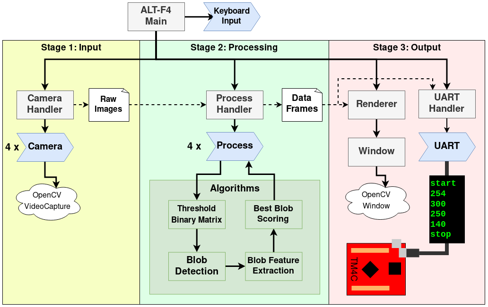

# ALT-F4
Autonomous Laser Tracking & Firing 4-Camera Turret

California State University, Long Beach (CSULB) Senior Project, 
which received 1st place award at the presentation expo

## Embedded System Implementation
See [Embedded ALTF4](https://github.com/jelucian/altf4), by [jelucian](https://github.com/jelucian)

## Software System Implementation

* Our professor gave us the design constraint of not being allowed to used OpenCV for any form of processing, as that would simplify project greatly (one such example: [findContours()](https://docs.opencv.org/2.4/modules/imgproc/doc/structural_analysis_and_shape_descriptors.html))
* However, we were allowed to use OpenCV for VideoCapture, and its GUI, which are designated in the above diagram

*Legend: (Note: For sake of brevity, I chose not to include everything in diagram)*
|Symbol|Meaning|
|----|-------|
|Light Grey Rectangle|Class Implementation||
|Blue Arrow Polygon|Parallel Process Thread/Class (uses std::thread)|
|White Corner-Folded-File|Data to be Passed Through Program|
|White Cloud|OpenCV Implementation Detail|
|Black Box Green Text|UART Protocol (Start, GreenX, GreenY, RedX, RedY, Stop)|
|Red Micro controller|[Tiva C Tm4c123gh6pm](http://www.ti.com/lit/ds/symlink/tm4c123gh6pm.pdf)|

*Stages:*
1. Input
    * Try to open up four camera threads, but open less if not all are found
    * Once cameras are found, activate v4l-ctl script to lower camera exposure ([our cameras](https://images-eu.ssl-images-amazon.com/images/I/71u8nSMB9pS.pdf) were very over-sensitive to light)
    * Continuously grab both RGB and HSV representation, and store/overwrite them in an array of images
    * Wait for main program to request access, then copy off the images array. (Could've used double-buffered approach but ran into weird bugs, and decided against premature optimizations)
2. Processing 
    * Data Extraction (As seen in [algorithm.hpp](software/src/algorithm.hpp))
    * Blob Scoring (As seen in [algorithm.hpp](software/src/algorithm.hpp))

    [algorithm.hpp](software/src/algorithm.hpp) Overview:
```c++
/* Basic Data Extraction Functions */
// Extract meaningful data from image data
    // Read original image, apply pixel color thresholds, and extract binary image
    void writeBinaryData( Image* image, Image& binary_image, const std::pair< Color, Color >& thresholds );

    // Read Binary Matrices and try to extrapolate blobs from it
    void getBlobs( Image* image, std::vector< std::vector< Color > >& color_2d, 
                   std::vector< unsigned char* >& binary_data_2d, std::vector< Blob >& all_blobs );

/* Basic Scoring Algorithms */
// Scoring metrics applied to every single blob
// Scores on scale int( 0 - 255 )
    // Calculate Score
    void scoreBlobs( std::vector< std::vector< Color > >& color_2d, std::vector< unsigned char* >& binary_data_2d, std::vector< Blob >& blobs, Blob& best_blob, int type, int camera_index )

        // Score by closeness to expected color (hsv)
        unsigned char scoreAverageColor( Color& average_color, const Color& expected_color, int multiplier )

        // Score by closeness to expected area (width * height)
        unsigned char scoreArea( unsigned int area, const unsigned int expected_area, int multiplier )

        // Score by closeness to expected size (#pixels)
        unsigned char scoreSize( unsigned int size, const unsigned int expected_size, int multiplier )

        // Score by closeness to expected core color (hsv)
        unsigned char scoreAverageCoreColor( const Color average_color, const Color expected_color, const std::vector< bool > channel_masks, int multiplier )

        // Score by closeness to expected core length (length of each anchor) 
        unsigned char scoreAverageCoreLength( const float average_core_length, const int expected_length, int multiplier )

        // Score by closeness to expected convolution average (https://en.wikipedia.org/wiki/Kernel_(image_processing))
        unsigned char scoreConvolutionAverage( unsigned char average, const unsigned int expected_average, int multiplier )

/* Rigorous Data Extraction Functions */
    // Get Convolution of Blob
    void convoluteBlob( Blob& blob, std::vector< std::vector< Color > >& color_2d, const std::vector< std::vector< int > >& kernel )

    // Try to grab core of blob and any features that come out of that
    Core calculateCore( Blob& blob, std::vector< std::vector< Color > >& color_2d, std::vector< unsigned char* >& binary_data_2d )

/* Rigourous Scoring Algorithms */
// Scoring metrics applied to best scoring blobs 
// (way more computationally expensive, but hopefully 
// operated on only a select few best blob choices) 
// Scores on scale float( 0 - 1 )
    // Score already partially successful blob to really make sure it's a laser
    float rigorouslyScoreBlob( Blob& blob, std::vector< std::vector< Color > >& color_2d, 
            std::vector< unsigned char* >& binary_data_2d, int type, int camera_index )
        // Scored Features:
            // Core expected average color
            // Core expected average length
            // Core exploded
            // Convolution Average
```
3. Output
    * Take best blob from each dataframe, and draw relevant boxes/text to screen
    * Take best blob coordinates for Red / Green blobs, and transmit them over UART
        
        UART Protocol Example: ( Green Laser Center: ( x=123, y=321 ), Red Laser Center: ( x=456, y=234 ) )

        |start|green_X|green_Y|red_X|red_Y|stop|
        |-----|-------|-------|-----|-----|----|
        |start|  123  |  321  | 456 | 234 |stop|
4. [Compute Error, and spin stepper / servo motors to compensate + much more (Turret + Glove code)](https://github.com/jelucian/ALTF4)

## Inspirations
[Polar Movie Machine Gun Shootout Scene (2019) (Youtube)](https://youtu.be/SokRWSncxTQ)

## Final Demo Video
[Final Demo (Youtube)](https://youtu.be/QH2Hx7XE3m8)

## Collaborators
* Alex Jong ([@jongbot](https://github.com/jongbot))
* Jesus Luciano ([@jelucian](https://github.com/jelucian))
* Steven Cagle ([@scagle](https://github.com/scagle))
